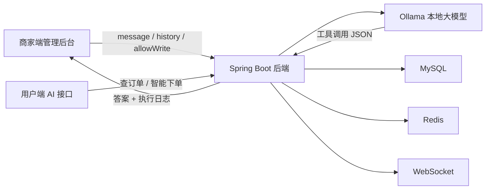

# 小微外卖 AI 增强版

一个基于 Spring Boot + Vue2 + TypeScript 的外卖系统毕业设计项目。在传统的菜品、套餐、订单、员工、数据统计等业务模块基础上，项目进一步引入本地大模型能力，让 AI 不再只是“聊天入口”，而是能够理解业务语义、调用真实业务能力、返回可追踪执行结果的智能助手。

## 项目定位

这个项目的重点不是单纯“给外卖系统加一个对话框”，而是让 AI 真正进入业务链路：

- 商家端可以通过自然语言查询数据库、执行受控写库操作，并在前端界面中看到结构化执行结果与执行轨迹。
- 用户端可以通过自然语言查询当前订单、历史订单，并直接发起智能下单。
- 整个 AI 流程带有读写权限开关、SQL 约束、字段脱敏和执行日志展示，尽量避免“黑盒式” AI 调用。

## 核心亮点

### 1. 商家端 AI 数据客服

- 支持自然语言查询业务数据，例如订单、员工、菜品、套餐等。
- 支持受控的 `SELECT / INSERT / UPDATE / DELETE`，并通过 `allowWrite` 开关控制是否允许写库。
- 后端会根据数据库表结构构造 schema 上下文，引导模型生成更贴近真实业务的数据操作语句。
- 对 SQL 做了单语句、危险关键字、表名范围、`WHERE` 条件等约束校验。
- 查询结果不会直接把 JSON 扔给用户，而是整理为中文摘要、结果表格和执行日志。

对应实现可重点查看：

- [AiCustomerServiceImpl.java](./sky-take-out/sky-server/src/main/java/com/sky/service/impl/AiCustomerServiceImpl.java)
- [index.vue](./project-sky-admin-vue-ts/src/views/aiService/index.vue)

### 2. 用户端 AI 智能客服与智能下单

- 支持查询当前订单状态和历史订单记录。
- 支持从自然语言中抽取商品名、数量、备注等信息，自动组装下单请求。
- 默认地址、购物车恢复、失败提示等业务细节也被纳入了 AI 工具调用流程，而不是只停留在“回答建议”层。

对应实现可重点查看：

- [UserAiCustomerServiceImpl.java](./sky-take-out/sky-server/src/main/java/com/sky/service/impl/UserAiCustomerServiceImpl.java)
- [AiCustomerServiceController.java](./sky-take-out/sky-server/src/main/java/com/sky/controller/user/AiCustomerServiceController.java)

### 3. 传统外卖业务能力完整

除了 AI 模块外，系统本身也保留了比较完整的外卖管理能力：

- 员工管理
- 菜品管理
- 分类管理
- 套餐管理
- 订单管理
- 数据统计与可视化
- WebSocket 消息推送
- Redis 缓存

## 系统架构



## 技术栈

- 后端：Spring Boot 2.7.3、MyBatis、Druid、PageHelper、Redis、WebSocket
- 前端：Vue 2、TypeScript、Element UI、Vuex、ECharts
- AI：Ollama、本地模型配置默认指向 `deepseek-r1:7b`
- 数据层：MySQL
- 其他：Knife4j、JWT、阿里云 OSS

## 项目结构

```text
project_01
├─ sky-take-out                # Spring Boot 后端
│  ├─ sky-common
│  ├─ sky-pojo
│  └─ sky-server
├─ project-sky-admin-vue-ts    # Vue2 + TS 管理端前端
├─ update_dish_images.sql      # 菜品图片补充脚本
├─ docs                        # GitHub 上传与展示文案
└─ README.md
```

## 快速开始

### 运行环境

- JDK 8+
- Maven 3.6+
- Node.js 16 左右版本更稳妥
- MySQL 8.x
- Redis
- Ollama

### 后端启动

1. 进入后端目录：

```bash
cd sky-take-out
```

2. 准备配置文件：

- 参考 [application-dev.example.yml](./sky-take-out/sky-server/src/main/resources/application-dev.example.yml)
- 不要把真实密钥直接提交到 GitHub
- 当前仓库仅提供 [update_dish_images.sql](./update_dish_images.sql) 作为图片补充脚本，完整业务库初始化请结合你本地数据库环境准备

3. 启动本地模型服务：

```bash
ollama serve
ollama pull deepseek-r1:7b
```

4. 启动后端：

```bash
mvn spring-boot:run -pl sky-server
```

### 前端启动

1. 进入前端目录：

```bash
cd project-sky-admin-vue-ts
```

2. 准备环境变量：

- 参考 [.env.development.example](./project-sky-admin-vue-ts/.env.development.example)

3. 安装依赖并启动：

```bash
npm install
npm run serve
```

## 演示建议

如果你要在 GitHub、答辩或视频演示里突出 AI 亮点，可以直接展示下面这几类场景：

- 商家端查询："查询今天的订单数量"
- 商家端写库："新增员工：姓名王磊，账号 wanglei001，手机号 13800001234，状态启用"
- 商家端解释结果：展示 AI 返回的表格卡片、影响行数和执行轨迹
- 用户端查询："帮我看最近 3 笔订单"
- 用户端下单："帮我下一单鱼香肉丝和可乐，送到默认地址"

## 适合写在 GitHub 首页的一句话

> 一个将本地大模型真正接入外卖业务流程的毕业设计项目：AI 不只负责回答问题，还能在受控条件下查询业务数据、辅助操作数据库、理解用户下单意图并调用真实业务能力。

## 上传 GitHub 前请先注意

- 当前后端开发配置中存在真实数据库、OSS、微信等敏感信息，公开前必须替换。
- `sky-take-out` 目录当前带有独立 `.git`，如果你准备把前后端合并上传为一个仓库，需要先处理这个嵌套仓库。
- `node_modules`、`dist`、日志文件、IDE 配置、论文辅助脚本目录都不建议一起公开。
- 当前仓库只看到了管理端前端和后端代码；用户端如果你后续也要展示，可以单独补充说明或补充目录。

更完整的 GitHub 文案、仓库命名、标签和上传建议见：

- [docs/GITHUB_UPLOAD_GUIDE.md](./docs/GITHUB_UPLOAD_GUIDE.md)
